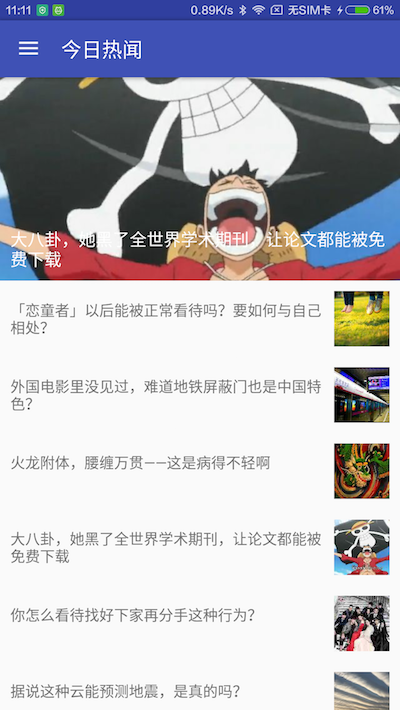
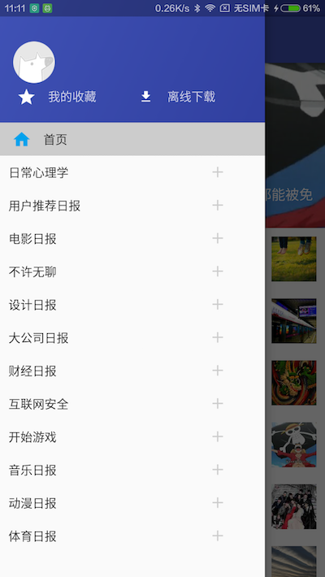
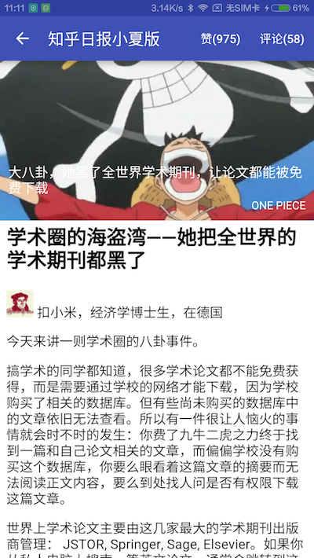
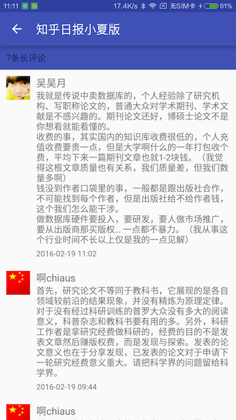

# XiaoxiaZhihu_AAC

---

参考知乎日报，使用网络上的[Api](https://github.com/izzyleung/ZhihuDailyPurify/wiki/%E7%9F%A5%E4%B9%8E%E6%97%A5%E6%8A%A5-API-%E5%88%86%E6%9E%90)，仿写了一个知乎日报客户端。

由于使用非正常手段获取Api，若被告知需停止共享与使用，本人会及时删除此页面与整个项目。

客户端使用了17年google IO发布的最新架构——
[Android Architecture Components](https://developer.android.com/topic/libraries/architecture/index.html)，网络层使用了okhttp+retrofit2，json解析使用gson，模型层使用了autovalue。
图片加载使用picasso，注解使用了dagger2，UI层移除了Butterknife，使用Databinding。

## 其他客户端

[XiaoxiaZhihu iOS客户端](https://github.com/LiushuiXiaoxia/XiaoxiaZhihu_iOS)

[XiaoxiaZhihu Android客户端Java版本](https://github.com/LiushuiXiaoxia/XiaoxiaZhihu)

[XiaoxiaZhihu Android客户端Kotlin版本](https://github.com/LiushuiXiaoxia/XiaoxiaZhihu_Kotlin)

[XiaoxiaZhihu Android客户端Android Architecture Components版本](https://github.com/LiushuiXiaoxia/XiaoxiaZhihu_AAC)

[XiaoxiaZhihu客户端ReactNative版本](https://github.com/LiushuiXiaoxia/XiaoxiaZhihuRN)

[XiaoxiaZhihu客户端Weex版本](https://github.com/LiushuiXiaoxia/XiaoxiaZhihuWeex)

[XiaoxiaZhihu客户端微信小程序](https://github.com/LiushuiXiaoxia/XiaoxiazhihuWx)

## 效果图

